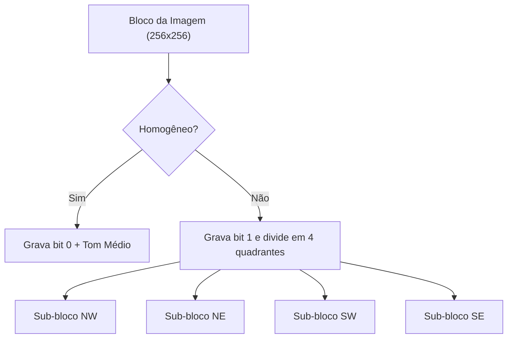

# 🖼️ Compressor e Descompressor de Imagens PGM (Quadtree)

[](https://en.wikipedia.org/wiki/C_(programming_language))
[]()
[-lightgrey?style=for-the-badge)]()

Projeto final desenvolvido para a disciplina de **Laboratório de Programação**. Implementa um pipeline completo de compressão e reconstrução de imagens em níveis de cinza no formato **PGM (Portable Graymap)** utilizando a estrutura de dados **Quadtree**.

---

## 🧠 Como Funciona o Algoritmo

A compressão por **Quadtree** explora a redundância espacial da imagem:

1. **Divisão Recursiva**: A imagem (composta por blocos de dimensão $2^N 	imes 2^N$) é analisada por quadrantes.
2. **Critério de Homogeneidade**:
   * O algoritmo calcula a variância / desvio entre os tons de cinza dos pixels no bloco atual.
   * Se o bloco for considerado **homogêneo** (variação abaixo de um limiar), ele é representado por um bit indicativo (`0`) seguido do valor médio dos pixels daquela região.
   * Caso contrário, emite-se um bit (`1`) e o bloco é recursivamente subdividido em 4 quadrantes (Noroeste, Nordeste, Sudoeste, Sudeste).
3. **Geração de Bitstream Compacto**: A árvore resultante é serializada bit a bit no arquivo `bitstream.bin`.
4. **Descompressão**: O descompressor lê a árvore serializada e reconstrói fielmente a matriz de pixels, gerando `reconstruida.pgm`.



---

## 📁 Estrutura de Arquivos

* `compressor.c`: Código-fonte responsável por ler a imagem PGM, aplicar a Quadtree e gerar o `bitstream.bin`.
* `descompressor.c`: Código-fonte que interpreta o `bitstream.bin` e reconstrói o arquivo `reconstruida.pgm`.
* `img01.pgm`, `img02.pgm`, `img03.pgm`: Imagens de teste padrão para avaliação da taxa de compressão e fidelidade visual.

---

## 🚀 Compilação e Uso

### 1. Compilação com GCC

```bash
# Compilar o compressor
gcc compressor.c -o compressor.exe

# Compilar o descompressor
gcc descompressor.c -o descompressor.exe
```

### 2. Comprimir uma Imagem

```bash
./compressor.exe img01.pgm
```
*Saída gerada*: `bitstream.bin` (arquivo binário compactado).

### 3. Descomprimir e Reconstruir

```bash
./descompressor.exe bitstream.bin
```
*Saída gerada*: `reconstruida.pgm` (imagem restaurada pronta para visualização).

---

## 👨‍💻 Autor

Desenvolvido por **João Mateus** ([@aomaaj](https://github.com/aomaaj)).
